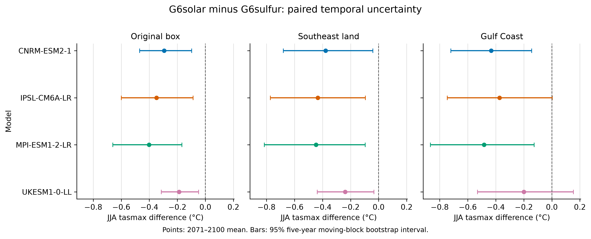

# SRM Regional Impact Explorer

An open, reproducible starter project for comparing regional climate responses under solar radiation modification scenarios.

The current scientific question is:

> Are late-century G6solar-minus-G6sulfur regional differences large relative to year-to-year variability within each model, and which Phase 6 findings remain strongest after explicit temporal-variability analysis?

## Current status

Phase 7 adds paired annual and seasonal time-series analysis for all four matched monthly models, three experiments, both monthly variables, and the original-box, Southeast-land, and Gulf-Coast domains. It preserves the Phase 6 native-grid fractional geodesic weighting and exact geographic definitions. Model-level outputs report paired interannual variability, standardized effects, and reproducible 95% five-year moving-block bootstrap intervals. Ensemble outputs keep those temporal intervals separate from structural spread across model climatological means.

Raw NetCDF files and the generated gridded analysis table stay outside Git. Exact source URLs, versions, tracking IDs, byte counts, SHA-256 checksums, licenses, variants, grids, and parent-run metadata are versioned in the repository.

The repository retains a deterministic synthetic-data generator for tests. A fresh checkout includes compact model-derived Phase 7 time series and manuscript tables without downloading raw data. The Phase 6 explorer and all prior scientific outputs remain reproducible historical references.

## Current result

The JJA G6solar-minus-G6sulfur `tasmax` ordering remains negative across all four matched models and all three broad Southeast domains. The ensemble mean is -0.308°C for the original box, -0.374°C over Southeast land, and -0.373°C over the Gulf Coast. With the primary five-year moving-block method, temporal intervals exclude zero in four of four models over the original box and Southeast land and two of four over the Gulf Coast. A three-year block sensitivity case reduces the original-box and land-only counts to three of four because the weaker UKESM1-0-LL interval includes zero. The consistent model-mean ordering is therefore stronger than the exact interval count.

MAM temperature remains unresolved at a 2-2 model-mean split over Southeast land, with only one model interval excluding zero. Precipitation is weaker still: Southeast-land JJA precipitation has a 3-1 mean-sign split but only one positive interval excluding zero, while annual precipitation splits 2-2 and all four intervals include zero. Gulf Coast JJA precipitation splits 2-2; two positive intervals exclude zero and both negative intervals include zero.

Temporal intervals measure sampling uncertainty within one model simulation under the block-resampling assumptions. They do not measure uncertainty across GeoMIP models. Inter-model sample SD is reported separately.



See [the Phase 7 checkpoint](docs/PHASE7_CHECKPOINT.md) for methods, model-level uncertainty, block-length sensitivity, and limitations; [the Phase 7 build instructions](docs/PHASE7_BUILD.md); and [the geographic definitions](docs/PHASE6_GEOGRAPHY.md). Phases [3](docs/PHASE3_CHECKPOINT.md), [4](docs/PHASE4_CHECKPOINT.md), [5](docs/PHASE5_CHECKPOINT.md), and [6](docs/PHASE6_CHECKPOINT.md) remain versioned historical checkpoints.

## Current experiments

- `ssp585`: high-forcing reference scenario
- `G6solar`: solar-irradiance reduction against the SSP5-8.5 background
- `G6sulfur`: stratospheric sulfate intervention against the SSP5-8.5 background

The deterministic demonstration generator and historical temperature manifests also retain `ssp245`, but it is not part of the current Phase 7 comparison.

## Current metrics

- `tasmax_mean`: mean daily maximum near-surface air temperature
- `pr_mean`: mean precipitation rate
- `txx`: maximum daily maximum temperature
- `hwn_tx90_3d`: heatwave event count above historical TX90, three-day minimum
- `hwf_tx90_3d`: days participating in those heatwaves
- `hwd_tx90_3d`: longest qualifying heatwave
- `rx1day`: maximum one-day precipitation
- `rx5day`: maximum consecutive five-day precipitation
- `cdd`: maximum consecutive dry days below 1 mm/day
- `r95ptot`: precipitation on days above the historical wet-day 95th percentile

## Quick start

```bash
python -m pip install -r requirements.txt
python app.py
```

The app uses the real processed table when present. If it is missing, the app creates a deterministic demonstration CSV automatically. Run `python scripts/generate_demo_data.py` directly when you want to regenerate the demonstration data.

Run tests:

```bash
pytest
```

## Reproduce the scientific outputs

The real-data manifests contain the matched monthly files and daily MPI-ESM1-2-LR files. Reproduce the current Phase 7 tables and figures with:

```bash
python scripts/build_phase7.py --download
python scripts/make_phase7_figures.py
pytest
```

The build retains a resumable ignored native-grid cache. See `docs/PHASE7_BUILD.md` for cache controls and output details. Reproduce the historical Phase 6 spatial and daily outputs with:

```bash
python scripts/fetch_phase6_geography.py
python scripts/build_phase6.py --stage monthly --download
python scripts/build_phase6.py --stage daily --download
python scripts/make_phase6_outputs.py
```

The downloader validates every file against its recorded byte count and SHA-256 checksum before the analysis begins. The build also checks embedded experiment, model, variant, grid, tracking, and parent metadata. Raw NetCDF and the gridded processed CSV remain untracked by Git; compact regional result tables are versioned under `docs/`.

For other models or variables:

1. Resolve exact files and checksums through the ESGF Search API.
2. Add a versioned manifest under `data/manifests/`.
3. Place downloaded files under `data/raw/`.
4. Use `scripts/prepare_geomip.py` to convert gridded climatologies to the explorer schema.
5. Write the combined file to `data/processed/regional_metrics.csv` with `is_demo=false`.

See [docs/DATA_PLAN.md](docs/DATA_PLAN.md) for variables, time periods, quality checks, and publication criteria.

## Repository structure

```text
app.py                         Gradio application
src/srm_explorer/analysis.py  Data loading, validation, summaries, plots
scripts/generate_demo_data.py Deterministic demonstration data generator
scripts/prepare_geomip.py     NetCDF-to-explorer preprocessing starter
scripts/download_manifest.py  Checksum-verifying ESGF downloader
scripts/build_phase1.py        Reusable single-variable validated build
scripts/build_phase4.py        Matched two-variable Phase 4 build
scripts/build_phase5.py        Matched daily-extremes Phase 5 build
scripts/build_phase6.py        Resumable spatial and uncertainty build
scripts/build_phase7.py        Paired monthly temporal-variability build
scripts/prepare_daily_extremes.py Daily index calculation on native grids
scripts/make_phase3_outputs.py Phase 3 regional tables and figures
scripts/make_phase4_outputs.py Phase 4 precipitation tables and figures
scripts/make_phase5_outputs.py Phase 5 extremes table and figures
scripts/make_phase6_outputs.py Phase 6 maps and sensitivity figures
scripts/make_phase7_figures.py Phase 7 manuscript-oriented figures
data/manifests/                Versioned source records and checksums
data/processed/               Generated or explorer-ready tables
docs/DATA_PLAN.md             Real-data acquisition and validation plan
docs/PHASE1_RESULT.md         First result, method, and limitations
docs/PHASE2_CHECKPOINT.md      Two-model checkpoint and limitations
docs/PHASE3_MODEL_SELECTION.md Model inclusion and exclusion audit
docs/PHASE3_CHECKPOINT.md      Four-model results, uncertainty, and limits
docs/PHASE4_MODEL_SELECTION.md Precipitation selection and provenance audit
docs/PHASE4_CHECKPOINT.md      Matched precipitation results and uncertainty
docs/PHASE5_MODEL_SELECTION.md Daily-data selection and exclusion audit
docs/PHASE5_CHECKPOINT.md      Daily-extremes result and limitations
docs/PHASE6_GEOGRAPHY.md       Boundaries, domains, and weighting
docs/PHASE6_CHECKPOINT.md      Spatial robustness and uncertainty results
docs/PHASE7_CHECKPOINT.md      Temporal variability and effect-size results
docs/PHASE7_BUILD.md           Reproducible Phase 7 build commands
tests/                         Automated checks
```

## Scientific guardrails

- Always display whether records are synthetic or model-derived.
- Preserve model identity instead of presenting an ensemble mean alone.
- Report spread and model count with every multi-model result.
- Label single-model results explicitly and do not calculate meaningless ensemble spread.
- Match variants and parent branches explicitly; never substitute an ensemble member silently.
- Calculate regional means on native grids before combining models.
- Do not treat `G6solar` as a complete engineering representation of satellite mirrors. It is a climate-model experiment based on reduced solar irradiance.
- Distinguish equal global forcing targets from equal regional outcomes.

## Suggested public title

**Regional Climate Responses to Solar Intervention: Comparing G6solar and G6sulfur over the Southeast United States**
