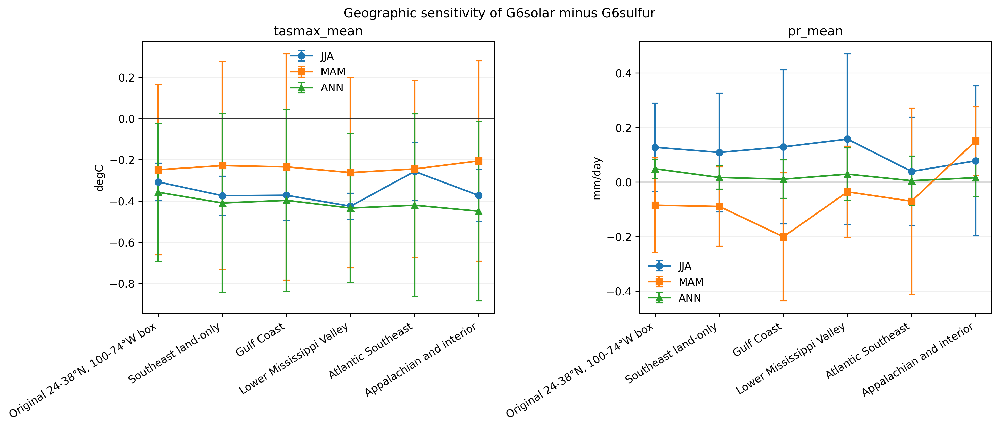

# SRM Regional Impact Explorer

An open, reproducible starter project for comparing regional climate responses under solar radiation modification scenarios.

The current scientific question is:

> Where do late-century G6solar and G6sulfur temperature and precipitation differences persist across the Southeast United States, and which findings depend on geography, individual models, or temporal variability?

## Current status

Phase 6 provides spatial robustness, land-only sensitivity, subregional sensitivity, leave-one-model-out analysis, and year-level uncertainty context. The monthly analysis retains the matched four-model `tasmax` and precipitation ensemble from Phases 3 and 4. It calculates authoritative summaries using fractional geodesic cell-area weights on each native grid, then uses a documented 1° common grid only for ensemble maps. The daily analysis retains the Phase 5 MPI-ESM1-2-LR single-member case study and adds land-only maps and year-to-year variability for TXx, heatwave days, Rx5day, and CDD.

Raw NetCDF files and the generated gridded analysis table stay outside Git. Exact source URLs, versions, tracking IDs, byte counts, SHA-256 checksums, licenses, variants, grids, and parent-run metadata are versioned in the repository.

The repository retains a deterministic synthetic-data generator for tests. A fresh checkout uses committed model-derived Phase 6 summaries in the explorer without downloading raw data. Every selection is restricted to an available model, metric, season, and comparison.

## Current result

The JJA temperature ordering persists over land. G6solar minus G6sulfur is -0.308°C for the original box and -0.374°C over Southeast land, with all four models negative in both domains. No leave-one-model-out result reverses the JJA sign. MAM temperature remains unresolved at a 2-2 model split.

Precipitation is less robust. The JJA direct difference is +0.127 mm/day over the original box with a 3-1 sign split, +0.109 mm/day over Southeast land with a 3-1 split, and +0.129 mm/day over Gulf Coast states with a 2-2 split. The original-box annual sign is positive in all four models but becomes 2-2 over Southeast land. Fifteen precipitation leave-one-model-out cases reverse the full-ensemble sign across 14 domain-season combinations.

In the single-model daily case study, the land-only JJA G6solar-minus-G6sulfur difference is -0.416°C for TXx, -7.019 heatwave days, -2.126 mm for Rx5day, and -0.874 days for CDD. Only the heatwave-day moving-block interval excludes zero. These intervals measure within-simulation temporal sampling variability, not structural model uncertainty.



See [the Phase 6 checkpoint](docs/PHASE6_CHECKPOINT.md) for methods, agreement, uncertainty, and limitations; [the geographic definitions](docs/PHASE6_GEOGRAPHY.md); and [the reproducible build commands](docs/PHASE6_BUILD.md). Phases [3](docs/PHASE3_CHECKPOINT.md), [4](docs/PHASE4_CHECKPOINT.md), and [5](docs/PHASE5_CHECKPOINT.md) remain versioned historical checkpoints.

## Current experiments

- `ssp585`: high-forcing reference scenario
- `G6solar`: solar-irradiance reduction against the SSP5-8.5 background
- `G6sulfur`: stratospheric sulfate intervention against the SSP5-8.5 background

The deterministic demonstration generator and historical temperature manifests also retain `ssp245`, but it is not part of the Phase 5 direct comparison.

## Current metrics

- `tasmax_mean`: mean daily maximum near-surface air temperature
- `pr_mean`: mean precipitation rate
- `txx`: maximum daily maximum temperature
- `hwn_tx90_3d`: heatwave event count above historical TX90, three-day minimum
- `hwf_tx90_3d`: days participating in those heatwaves
- `hwd_tx90_3d`: longest qualifying heatwave
- `rx1day`: maximum one-day precipitation
- `rx5day`: maximum consecutive five-day precipitation
- `cdd`: maximum consecutive dry days below 1 mm/day
- `r95ptot`: precipitation on days above the historical wet-day 95th percentile

## Quick start

```bash
python -m pip install -r requirements.txt
python app.py
```

The app uses the real processed table when present. If it is missing, the app creates a deterministic demonstration CSV automatically. Run `python scripts/generate_demo_data.py` directly when you want to regenerate the demonstration data.

Run tests:

```bash
pytest
```

## Replace the demonstration data

The real-data manifests contain the matched monthly files and daily MPI-ESM1-2-LR files. Download, verify, process, and reproduce the current tables and figures with:

```bash
python scripts/fetch_phase6_geography.py
python scripts/build_phase6.py --stage monthly --download
python scripts/build_phase6.py --stage daily --download
python scripts/make_phase6_outputs.py
```

The downloader validates every file against its recorded byte count and SHA-256 checksum before the analysis begins. The build also checks embedded experiment, model, variant, grid, tracking, and parent metadata. Raw NetCDF and the gridded processed CSV remain untracked by Git; compact regional result tables are versioned under `docs/`.

For other models or variables:

1. Resolve exact files and checksums through the ESGF Search API.
2. Add a versioned manifest under `data/manifests/`.
3. Place downloaded files under `data/raw/`.
4. Use `scripts/prepare_geomip.py` to convert gridded climatologies to the explorer schema.
5. Write the combined file to `data/processed/regional_metrics.csv` with `is_demo=false`.

See [docs/DATA_PLAN.md](docs/DATA_PLAN.md) for variables, time periods, quality checks, and publication criteria.

## Repository structure

```text
app.py                         Gradio application
src/srm_explorer/analysis.py  Data loading, validation, summaries, plots
scripts/generate_demo_data.py Deterministic demonstration data generator
scripts/prepare_geomip.py     NetCDF-to-explorer preprocessing starter
scripts/download_manifest.py  Checksum-verifying ESGF downloader
scripts/build_phase1.py        Reusable single-variable validated build
scripts/build_phase4.py        Matched two-variable Phase 4 build
scripts/build_phase5.py        Matched daily-extremes Phase 5 build
scripts/build_phase6.py        Resumable spatial and uncertainty build
scripts/prepare_daily_extremes.py Daily index calculation on native grids
scripts/make_phase3_outputs.py Phase 3 regional tables and figures
scripts/make_phase4_outputs.py Phase 4 precipitation tables and figures
scripts/make_phase5_outputs.py Phase 5 extremes table and figures
scripts/make_phase6_outputs.py Phase 6 maps and sensitivity figures
data/manifests/                Versioned source records and checksums
data/processed/               Generated or explorer-ready tables
docs/DATA_PLAN.md             Real-data acquisition and validation plan
docs/PHASE1_RESULT.md         First result, method, and limitations
docs/PHASE2_CHECKPOINT.md      Two-model checkpoint and limitations
docs/PHASE3_MODEL_SELECTION.md Model inclusion and exclusion audit
docs/PHASE3_CHECKPOINT.md      Four-model results, uncertainty, and limits
docs/PHASE4_MODEL_SELECTION.md Precipitation selection and provenance audit
docs/PHASE4_CHECKPOINT.md      Matched precipitation results and uncertainty
docs/PHASE5_MODEL_SELECTION.md Daily-data selection and exclusion audit
docs/PHASE5_CHECKPOINT.md      Daily-extremes result and limitations
docs/PHASE6_GEOGRAPHY.md       Boundaries, domains, and weighting
docs/PHASE6_CHECKPOINT.md      Spatial robustness and uncertainty results
tests/                         Automated checks
```

## Scientific guardrails

- Always display whether records are synthetic or model-derived.
- Preserve model identity instead of presenting an ensemble mean alone.
- Report spread and model count with every multi-model result.
- Label single-model results explicitly and do not calculate meaningless ensemble spread.
- Match variants and parent branches explicitly; never substitute an ensemble member silently.
- Calculate regional means on native grids before combining models.
- Do not treat `G6solar` as a complete engineering representation of satellite mirrors. It is a climate-model experiment based on reduced solar irradiance.
- Distinguish equal global forcing targets from equal regional outcomes.

## Suggested public title

**Regional Climate Responses to Solar Intervention: Comparing G6solar and G6sulfur over the Southeast United States**
