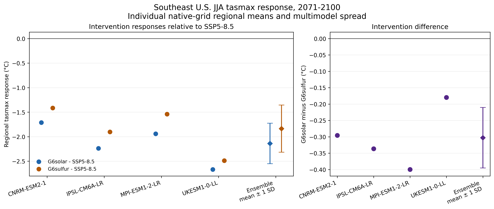

# SRM Regional Impact Explorer

An open, reproducible starter project for comparing regional climate responses under solar radiation modification scenarios.

The current scientific question is:

> How do G6solar and G6sulfur differ in their effects on late-century Southeast U.S. `tasmax`, and how consistently do matched models show that difference?

## Current status

Phase 3 provides a reproducible four-model checkpoint from official CMIP6 archive data. The matched comparison uses monthly `tasmax` from CNRM-ESM2-1, IPSL-CM6A-LR, MPI-ESM1-2-LR, and UKESM1-0-LL for 2071–2100. Raw NetCDF files and the generated gridded analysis table stay outside Git, while exact source URLs, versions, tracking IDs, byte counts, SHA-256 checksums, licenses, variants, grids, and parent-run metadata are versioned in the repository.

The repository retains a deterministic synthetic-data generator for interface tests. The app clearly identifies whether its active records are synthetic or model-derived.

## Current result

For the four-model mean, the 2071–2100 JJA area-weighted box-mean `tasmax` difference from SSP5-8.5 is -2.14 °C under G6solar and -1.84 °C under G6sulfur. Every included model shows cooling under both interventions and a more negative JJA response under G6solar. The mean G6solar-minus-G6sulfur difference is -0.30 °C, with individual models ranging from -0.40 to -0.18 °C.



This is a defensible matched four-model result, not a general conclusion about SRM. MAM splits 2–2 on the sign of the G6solar-minus-G6sulfur difference, and DJF G6sulfur includes one model with warming relative to SSP5-8.5. See [the Phase 3 checkpoint](docs/PHASE3_CHECKPOINT.md) for every seasonal statistic and limitation, and [the model-selection log](docs/PHASE3_MODEL_SELECTION.md) for inclusion and exclusion decisions. The [Phase 2 checkpoint](docs/PHASE2_CHECKPOINT.md) remains the historical two-model result.

## Phase 3 experiments

- `ssp585`: high-forcing reference scenario
- `G6solar`: solar-irradiance reduction against the SSP5-8.5 background
- `G6sulfur`: stratospheric sulfate intervention against the SSP5-8.5 background

The deterministic demonstration generator and historical manifests also retain `ssp245`, but it is not part of the Phase 3 direct comparison.

## Current metric

- `tasmax_mean`: mean daily maximum near-surface air temperature

## Quick start

```bash
python -m pip install -r requirements.txt
python app.py
```

The app uses the real processed table when present. If it is missing, the app creates a deterministic demonstration CSV automatically. Run `python scripts/generate_demo_data.py` directly when you want to regenerate the demonstration data.

Run tests:

```bash
pytest
```

## Replace the demonstration data

The real-data manifests contain the matched monthly `tasmax` files used for the four-model Phase 3 ensemble. Download, verify, process, and reproduce the tables and figures with:

```bash
python scripts/build_phase1.py --download
python scripts/make_phase3_outputs.py
```

The downloader validates every file against its recorded byte count and SHA-256 checksum before the analysis begins. The build also checks embedded experiment, model, variant, grid, tracking, and parent metadata. Raw NetCDF and the gridded processed CSV remain untracked by Git; compact regional result tables are versioned under `docs/`.

For other models or variables:

1. Resolve exact files and checksums through the ESGF Search API.
2. Add a versioned manifest under `data/manifests/`.
3. Place downloaded files under `data/raw/`.
4. Use `scripts/prepare_geomip.py` to convert gridded climatologies to the explorer schema.
5. Write the combined file to `data/processed/regional_metrics.csv` with `is_demo=false`.

See [docs/DATA_PLAN.md](docs/DATA_PLAN.md) for variables, time periods, quality checks, and publication criteria.

## Repository structure

```text
app.py                         Gradio application
src/srm_explorer/analysis.py  Data loading, validation, summaries, plots
scripts/generate_demo_data.py Deterministic demonstration data generator
scripts/prepare_geomip.py     NetCDF-to-explorer preprocessing starter
scripts/download_manifest.py  Checksum-verifying ESGF downloader
scripts/build_phase1.py        Checksum- and branch-validated four-model build
scripts/make_phase3_outputs.py Phase 3 regional tables and figures
data/manifests/                Versioned source records and checksums
data/processed/               Generated or explorer-ready tables
docs/DATA_PLAN.md             Real-data acquisition and validation plan
docs/PHASE1_RESULT.md         First result, method, and limitations
docs/PHASE2_CHECKPOINT.md      Two-model checkpoint and limitations
docs/PHASE3_MODEL_SELECTION.md Model inclusion and exclusion audit
docs/PHASE3_CHECKPOINT.md      Four-model results, uncertainty, and limits
tests/                         Automated checks
```

## Scientific guardrails

- Always display whether records are synthetic or model-derived.
- Preserve model identity instead of presenting an ensemble mean alone.
- Report spread and model count with every multi-model result.
- Match variants and parent branches explicitly; never substitute an ensemble member silently.
- Calculate regional means on native grids before combining models.
- Do not treat `G6solar` as a complete engineering representation of satellite mirrors. It is a climate-model experiment based on reduced solar irradiance.
- Distinguish equal global forcing targets from equal regional outcomes.

## Suggested public title

**Regional Climate Responses to Solar Intervention: Comparing G6solar and G6sulfur over the Southeast United States**
