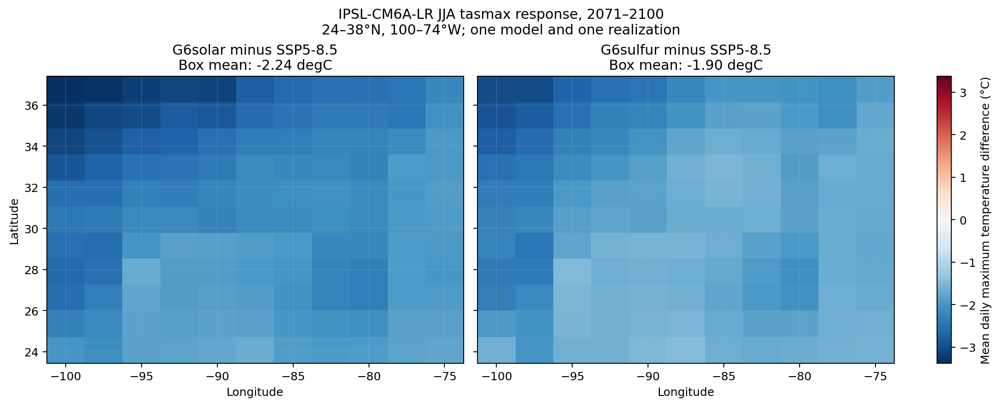

# Phase 1 result: late-century regional `tasmax`

## Question

How does late-century mean daily maximum near-surface air temperature respond to the GeoMIP G6solar and G6sulfur experiments relative to SSP5-8.5 in a box covering the Southeast United States and adjacent waters?

## First result

For IPSL-CM6A-LR realization `r1i1p1f1` during 2071–2100, the area-weighted JJA box mean is:

| Comparison | JJA difference from SSP5-8.5 |
| --- | ---: |
| G6solar | -2.24 °C |
| G6sulfur | -1.90 °C |
| SSP2-4.5 | -2.24 °C |

The annual-mean differences are -2.11 °C for G6solar, -1.71 °C for G6sulfur, and -2.00 °C for SSP2-4.5. In this one-model result, G6solar produces about 0.34 °C more JJA cooling than G6sulfur within the analysis box. This is a model result, not an observed effect or a multi-model conclusion.



## Method

- Source: official ESGF-hosted CMIP6/GeoMIP monthly `tasmax` output
- Model and realization: IPSL-CM6A-LR `r1i1p1f1`
- Experiments: G6solar, G6sulfur, SSP5-8.5, and SSP2-4.5
- Period: 2071–2100
- Domain: 24–38°N, 100–74°W
- Statistic: monthly values averaged into seasonal climatologies, followed by a cosine-latitude-weighted box mean
- Integrity: every NetCDF file is checked against the byte count and SHA-256 digest recorded in [`data/manifests/ipsl_tasmax_amon.json`](../data/manifests/ipsl_tasmax_amon.json)

Reproduce the data and figure with:

```bash
python scripts/build_phase1.py --download
python scripts/make_phase1_figure.py
```

## Limits

- One climate model and one realization cannot establish robustness or quantify inter-model uncertainty.
- The rectangular domain includes ocean and areas outside common definitions of the Southeast. A land mask and named subregions are planned.
- Monthly `tasmax` supports a climatological heat comparison, not daily heat extremes.
- G6solar is an idealized reduction of solar irradiance. It is not an engineering simulation of orbital mirrors.
- Equal global forcing targets do not imply equal regional responses.

## Next scientific step

Repeat the matched analysis across the six CMIP6 models that publish both G6solar and G6sulfur, then report the ensemble median, range, and sign agreement at each grid cell.
