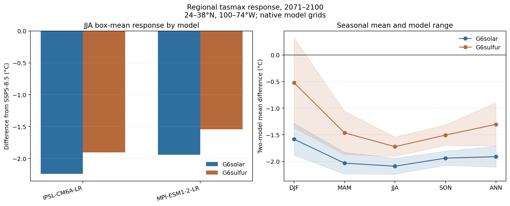

# Phase 2 checkpoint: two-model regional comparison

## Scope

This checkpoint adds MPI-ESM1-2-LR to the IPSL-CM6A-LR analysis. Each intervention is compared with the SSP5-8.5 realization identified in its NetCDF parent metadata. Calculations remain on each model's native grid, and regional means are computed before models are combined.

## JJA result

| Model | G6solar minus SSP5-8.5 | G6sulfur minus SSP5-8.5 |
| --- | ---: | ---: |
| IPSL-CM6A-LR | -2.24 °C | -1.90 °C |
| MPI-ESM1-2-LR | -1.94 °C | -1.54 °C |
| Two-model mean | -2.09 °C | -1.72 °C |

Both models show a cooler late-century JJA box mean under both interventions, with stronger cooling under G6solar than G6sulfur. The G6solar-minus-G6sulfur difference is about 0.37 °C in the two-model mean.

## Seasonal signal

The two models agree on the sign of G6solar cooling in every season. They also agree on G6sulfur cooling in MAM, JJA, SON, and the annual mean. For DJF G6sulfur, IPSL-CM6A-LR gives -1.37 °C while MPI-ESM1-2-LR gives +0.32 °C relative to SSP5-8.5. That winter disagreement is a reason to expand the ensemble before interpretation.

## Provenance and integrity

- IPSL-CM6A-LR uses `r1i1p1f1`; its G6 files identify SSP5-8.5 `r1i1p1f1` as the parent.
- MPI-ESM1-2-LR uses `r2i1p1f1`; its G6 files identify SSP5-8.5 `r2i1p1f1` as the parent.
- All 16 source files are validated against ESGF byte counts and SHA-256 checksums.
- IPSL data carry CC BY-NC-SA 4.0 terms. MPI-M data carry CC BY-SA 4.0 terms. The manifests record these separately.
- Source manifests: [`ipsl_tasmax_amon.json`](../data/manifests/ipsl_tasmax_amon.json) and [`mpi_lr_tasmax_amon.json`](../data/manifests/mpi_lr_tasmax_amon.json).

## Limits

- Two models are not enough for a robust ensemble conclusion.
- The rectangular box includes ocean and areas outside common Southeast definitions.
- Monthly `tasmax` describes climatological mean daily maximum temperature, not daily heat extremes.
- Native-grid box means avoid invalid direct grid-cell averaging, but model grid geometry still affects regional sampling.
- G6solar is an idealized reduced-irradiance experiment, not an orbital-mirror engineering model.
