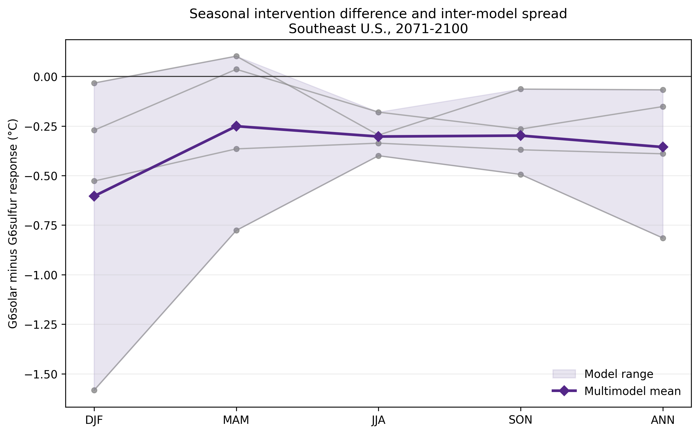

# Phase 3 checkpoint: defensible four-model `tasmax` ensemble

## Scientific question

How do G6solar and G6sulfur alter late-century seasonal and annual mean daily maximum near-surface air temperature over the Southeast United States relative to SSP5-8.5, and how consistently do the available matched models distinguish the two interventions?

This checkpoint addresses regional climate response, not engineering feasibility or deployment desirability.

## Model selection

The direct ensemble contains four GeoMIP/CMIP6 models:

| Model | Institution | G6solar | G6sulfur | SSP5-8.5 | Grid | Matching basis |
|---|---|---|---|---|---|---|
| CNRM-ESM2-1 | CNRM-CERFACS | `r1i1p1f2` | `r1i1p1f2` | `r1i1p1f2` | `gr` | All three are sibling branches from historical `r1i1p1f2`. |
| IPSL-CM6A-LR | IPSL | `r1i1p1f1` | `r1i1p1f1` | `r1i1p1f1` | `gr` | Both G6 runs identify the selected SSP5-8.5 member as parent. |
| MPI-ESM1-2-LR | MPI-M | `r2i1p1f1` | `r2i1p1f1` | `r2i1p1f1` | `gn` | Both G6 runs identify the selected SSP5-8.5 member as parent. |
| UKESM1-0-LL | MOHC | `r1i1p1f2` | `r1i1p1f2` | `r1i1p1f2` | `gn` | Both G6 runs identify the selected SSP5-8.5 member as parent. |

CESM2-WACCM is excluded because the available G6solar and G6sulfur `tasmax` files use incompatible variants and the inspected G6sulfur file reports no parent. MPI-ESM1-2-HR is excluded because no usable `tasmax` triplet was found. Full criteria, evaluated models, file issues, and reasons are recorded in [the versioned model-selection log](PHASE3_MODEL_SELECTION.md).

## Provenance and validation

Record-level manifests preserve source URL, version, tracking ID, byte count, SHA-256 checksum, institution, source ID, experiment ID, variant label, grid label, and license. Raw NetCDF files remain outside Git. The build validates each file against its manifest and checks embedded model, experiment, variant, grid, tracking, and parent metadata before processing.

During Phase 3 validation, an incomplete local IPSL SSP5-8.5 file was detected by its byte-count mismatch. It was replaced from the recorded source and then passed the recorded 49,328,739-byte and SHA-256 checks. No result below uses the incomplete copy.

The full automated test suite passes 17 tests. Tests cover schema and missing values, unit conversion, exact monthly coverage, complete cross-year DJF grouping, calendar-aware month lengths, latitude weighting, native-grid mapping, matched comparisons, model counts, and rejection of variant or parent mismatches.

## Analysis method

- Period: 2071-2100.
- Domain: grid-cell centers from 24-38°N and 100-74°W, unchanged from Phases 1 and 2.
- Variable: monthly `tasmax` (`Amon`), converted from kelvin to degrees Celsius.
- Seasons: MAM, JJA, SON, and annual means use 30 complete years. DJF uses 29 complete winters, assigned by January year from DJF 2072 through DJF 2100; December 2100 is not used without January-February 2101.
- Temporal aggregation: monthly values are weighted by the number of days in each model's native calendar within each complete seasonal year. Seasonal years are then averaged equally.
- Spatial aggregation: cosine-of-latitude weights are applied within each model's native grid. Regional model means are calculated before any models are combined.
- Ensemble aggregation: models receive equal weight. No grid cells from different model grids are averaged directly.
- Spread: sample standard deviation, model minimum, model maximum, count, and fraction agreeing on the majority sign are reported with mean and median.

## Results

All values are regional `tasmax` differences in °C. “Agreement” is the fraction of models with the majority sign; it is not a probability or formal confidence level.

| Season | Comparison | Mean | Median | SD | Model range | n | Sign agreement |
|---|---|---:|---:|---:|---:|---:|---:|
| DJF | G6solar - SSP5-8.5 | -1.59 | -1.57 | 0.44 | -2.02 to -1.21 | 4 | 100% |
| DJF | G6sulfur - SSP5-8.5 | -0.99 | -1.29 | 0.94 | -1.75 to +0.37 | 4 | 75% |
| DJF | G6solar - G6sulfur | -0.60 | -0.40 | 0.68 | -1.58 to -0.03 | 4 | 100% |
| MAM | G6solar - SSP5-8.5 | -1.93 | -1.99 | 0.33 | -2.24 to -1.51 | 4 | 100% |
| MAM | G6sulfur - SSP5-8.5 | -1.68 | -1.74 | 0.48 | -2.18 to -1.05 | 4 | 100% |
| MAM | G6solar - G6sulfur | -0.25 | -0.16 | 0.41 | -0.78 to +0.10 | 4 | 50% |
| JJA | G6solar - SSP5-8.5 | -2.14 | -2.09 | 0.41 | -2.67 to -1.71 | 4 | 100% |
| JJA | G6sulfur - SSP5-8.5 | -1.84 | -1.72 | 0.48 | -2.49 to -1.42 | 4 | 100% |
| JJA | G6solar - G6sulfur | -0.30 | -0.32 | 0.09 | -0.40 to -0.18 | 4 | 100% |
| SON | G6solar - SSP5-8.5 | -2.01 | -1.94 | 0.52 | -2.68 to -1.46 | 4 | 100% |
| SON | G6sulfur - SSP5-8.5 | -1.71 | -1.55 | 0.50 | -2.42 to -1.32 | 4 | 100% |
| SON | G6solar - G6sulfur | -0.30 | -0.32 | 0.18 | -0.49 to -0.06 | 4 | 100% |
| ANN | G6solar - SSP5-8.5 | -1.91 | -1.91 | 0.39 | -2.35 to -1.48 | 4 | 100% |
| ANN | G6sulfur - SSP5-8.5 | -1.56 | -1.57 | 0.54 | -2.20 to -0.90 | 4 | 100% |
| ANN | G6solar - G6sulfur | -0.36 | -0.27 | 0.34 | -0.81 to -0.07 | 4 | 100% |

The complete machine-readable outputs are [the per-model table](phase3_per_model.csv) and [the ensemble summary](phase3_ensemble_summary.csv).

### JJA individual models

| Model | G6solar - SSP5-8.5 | G6sulfur - SSP5-8.5 | G6solar - G6sulfur |
|---|---:|---:|---:|
| CNRM-ESM2-1 | -1.71 | -1.42 | -0.30 |
| IPSL-CM6A-LR | -2.24 | -1.90 | -0.34 |
| MPI-ESM1-2-LR | -1.94 | -1.54 | -0.40 |
| UKESM1-0-LL | -2.67 | -2.49 | -0.18 |

## Agreement and uncertainty

All four models show lower JJA `tasmax` under both interventions than under SSP5-8.5, and all four show a more negative JJA response for G6solar than for G6sulfur. The JJA intervention difference is comparatively consistent in sign and magnitude: mean -0.30 °C, range -0.40 to -0.18 °C.

That consistency does not extend uniformly across seasons. In MAM, two models give a negative G6solar-minus-G6sulfur difference and two give a positive difference, even though the ensemble mean is -0.25 °C. For DJF G6sulfur relative to SSP5-8.5, three models cool and MPI-ESM1-2-LR warms by +0.37 °C. DJF also has the largest spread for both the G6sulfur response and the intervention difference. These disagreements are part of the result, not outliers removed from it.

## Comparison with Phase 2

The Phase 2 two-model JJA means were -2.09 °C for G6solar and -1.72 °C for G6sulfur. Adding CNRM-ESM2-1 and UKESM1-0-LL changes the four-model means to -2.14 °C and -1.84 °C, respectively. The JJA G6solar-minus-G6sulfur mean changes from about -0.37 °C to -0.30 °C while retaining unanimous sign agreement.

Phase 3 also strengthens the methodology: all seasons now use calendar-aware day weighting, DJF is explicitly limited to complete winters, exact variants and parent relationships are carried into the processed schema, and code prevents cross-model grid averaging and incompatible branch matching. [The Phase 2 checkpoint](PHASE2_CHECKPOINT.md) remains the historical record of the earlier result.

## Limitations

- Four models remain a small ensemble and are not statistically independent.
- Equal model weighting does not account for model genealogy, performance, or dependence.
- The rectangular box includes ocean and places outside some definitions of the Southeast United States.
- Cosine-latitude weighting is appropriate for these regular latitude-longitude grids but is an approximation to explicit cell-area weights.
- Monthly `tasmax` is a climatological mean of daily maxima, not a daily heat-extreme metric.
- This checkpoint does not evaluate precipitation, daily extremes, other regions, intervention engineering, impacts, governance, or risk tradeoffs.
- GeoMIP G6 experiments target a global temperature trajectory; they do not imply identical regional forcing or circulation responses.

## Interpretation in the GeoMIP literature

The four-model JJA result is consistent with the existing GeoMIP finding that similar global-temperature targets can yield intervention-dependent regional responses. The seasonal spread and the DJF/MAM disagreements are also consistent with published warnings that aerosol processes and circulation changes can generate substantial regional uncertainty. The project result should therefore be described narrowly: this matched four-model sample agrees that G6solar produces a more negative Southeast U.S. JJA `tasmax` response than G6sulfur over 2071-2100. It is not evidence that one intervention is generally preferable, safer, or more effective across variables and regions.

See [the project literature review](LITERATURE_REVIEW.md) for the relevant GeoMIP context and citations.
