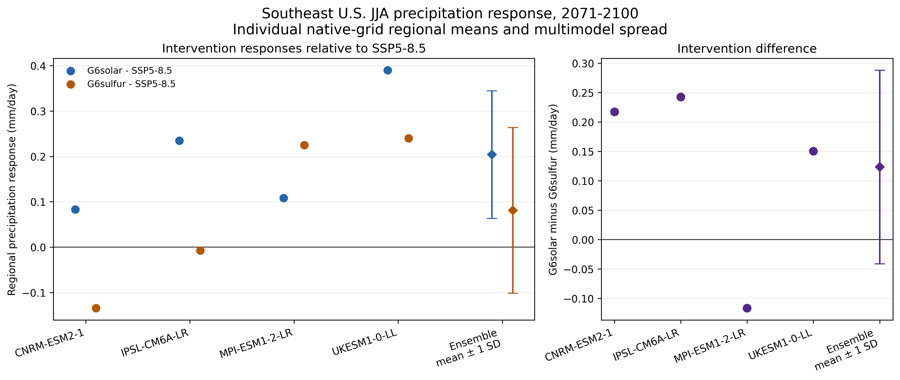
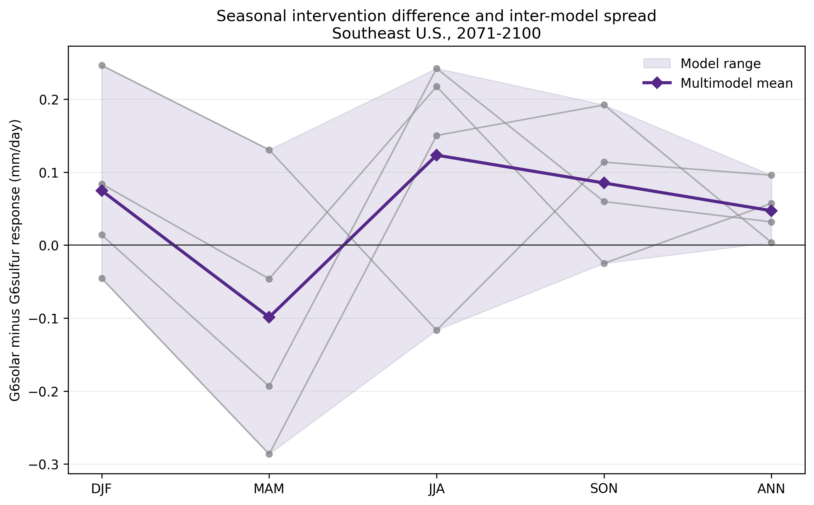

# Phase 4 checkpoint: matched precipitation response

## Scientific question

How do G6solar and G6sulfur alter late-century seasonal and annual mean precipitation over the Southeast United States relative to SSP5-8.5, and how consistently do the same four models used in Phase 3 distinguish the interventions?

This checkpoint evaluates regional climate response. It does not evaluate deployment engineering, impacts, or whether an intervention is desirable.

## Model selection

The comparison deliberately retains the exact Phase 3 sample so temperature and precipitation results do not differ because of model composition.

| Model | Institution | Variant | Grid | Matching basis |
|---|---|---|---|---|
| CNRM-ESM2-1 | CNRM-CERFACS | `r1i1p1f2` | `gr` | G6solar, G6sulfur, and SSP5-8.5 are sibling branches from historical `r1i1p1f2`. |
| IPSL-CM6A-LR | IPSL | `r1i1p1f1` | `gr` | Both G6 runs identify the selected SSP5-8.5 member as parent. |
| MPI-ESM1-2-LR | MPI-M | `r2i1p1f1` | `gn` | Both G6 runs identify the selected SSP5-8.5 member as parent. |
| UKESM1-0-LL | MOHC | `r1i1p1f2` | `gn` | Both G6 runs identify the selected SSP5-8.5 member as parent. |

The [Phase 4 model-selection log](PHASE4_MODEL_SELECTION.md) records the criteria, file availability, fixed-sample decision, and validation outcome.

## Provenance and validation

Four versioned precipitation manifests preserve the source URL, archive version, tracking ID, byte count, SHA-256 checksum, institution, source ID, experiment ID, variant label, grid label, license, and parent metadata for 18 files. Raw NetCDF files remain outside Git.

Every file passed its byte-count and SHA-256 check. The build also verified embedded model, experiment, variant, grid, tracking, and parent metadata before processing. It required one ordered value for every month from January 2071 through December 2100 and rejected unknown precipitation units. The full automated suite passes 22 tests.

## Analysis method

- Period: 2071-2100.
- Domain: grid-cell centers from 24-38°N and 100-74°W, unchanged from Phases 1-3.
- Variable: monthly precipitation flux (`pr`, `Amon`), converted from kg m⁻² s⁻¹ to mm/day by multiplying by 86,400.
- Seasons: MAM, JJA, SON, and annual means use 30 complete years. DJF uses 29 complete winters, DJF 2072 through DJF 2100.
- Temporal aggregation: monthly values are weighted by calendar-aware days per month within each seasonal year; seasonal years are averaged equally.
- Spatial aggregation: cosine-of-latitude weights are applied on each model's native grid. Regional means are calculated before models are combined.
- Ensemble aggregation: models receive equal weight. Grid cells from different models are never averaged directly.
- Uncertainty: mean, median, sample standard deviation, minimum, maximum, model count, fractions positive and negative, and majority-sign agreement are reported.

## Results

All values are regional precipitation-rate differences in mm/day. Sign agreement is the fraction of models with the majority sign, not a probability or formal confidence measure.

| Season | Comparison | Mean | Median | SD | Model range | n | Sign agreement |
|---|---|---:|---:|---:|---:|---:|---:|
| DJF | G6solar - SSP5-8.5 | -0.043 | -0.084 | 0.105 | -0.116 to +0.113 | 4 | 75% |
| DJF | G6sulfur - SSP5-8.5 | -0.117 | -0.089 | 0.147 | -0.320 to +0.029 | 4 | 75% |
| DJF | G6solar - G6sulfur | +0.075 | +0.049 | 0.126 | -0.045 to +0.246 | 4 | 75% |
| MAM | G6solar - SSP5-8.5 | +0.062 | +0.129 | 0.217 | -0.252 to +0.244 | 4 | 75% |
| MAM | G6sulfur - SSP5-8.5 | +0.161 | +0.162 | 0.160 | +0.013 to +0.308 | 4 | 100% |
| MAM | G6solar - G6sulfur | -0.099 | -0.120 | 0.182 | -0.286 to +0.131 | 4 | 75% |
| JJA | G6solar - SSP5-8.5 | +0.204 | +0.172 | 0.141 | +0.083 to +0.390 | 4 | 100% |
| JJA | G6sulfur - SSP5-8.5 | +0.081 | +0.109 | 0.183 | -0.134 to +0.240 | 4 | 50% |
| JJA | G6solar - G6sulfur | +0.123 | +0.184 | 0.165 | -0.117 to +0.242 | 4 | 75% |
| SON | G6solar - SSP5-8.5 | -0.227 | -0.239 | 0.057 | -0.282 to -0.149 | 4 | 100% |
| SON | G6sulfur - SSP5-8.5 | -0.313 | -0.341 | 0.071 | -0.360 to -0.207 | 4 | 100% |
| SON | G6solar - G6sulfur | +0.085 | +0.087 | 0.091 | -0.025 to +0.192 | 4 | 75% |
| ANN | G6solar - SSP5-8.5 | +0.002 | -0.005 | 0.037 | -0.036 to +0.054 | 4 | 75% |
| ANN | G6sulfur - SSP5-8.5 | -0.045 | -0.037 | 0.042 | -0.103 to -0.004 | 4 | 100% |
| ANN | G6solar - G6sulfur | +0.047 | +0.045 | 0.039 | +0.004 to +0.096 | 4 | 100% |

The complete machine-readable outputs are [the per-model table](phase4_per_model.csv) and [the ensemble summary](phase4_ensemble_summary.csv).

### JJA individual models

| Model | G6solar - SSP5-8.5 | G6sulfur - SSP5-8.5 | G6solar - G6sulfur |
|---|---:|---:|---:|
| CNRM-ESM2-1 | +0.083 | -0.134 | +0.217 |
| IPSL-CM6A-LR | +0.235 | -0.007 | +0.242 |
| MPI-ESM1-2-LR | +0.108 | +0.225 | -0.117 |
| UKESM1-0-LL | +0.390 | +0.240 | +0.150 |

## Agreement and uncertainty

The strongest sign agreement occurs for JJA G6solar, where all four models are wetter than SSP5-8.5, and for SON, where all four are drier under both interventions. JJA G6sulfur has no majority sign: CNRM-ESM2-1 and IPSL-CM6A-LR are drier, while MPI-ESM1-2-LR and UKESM1-0-LL are wetter.

The JJA ensemble mean indicates G6solar is 0.123 mm/day wetter than G6sulfur, but MPI-ESM1-2-LR reverses that sign. MAM also contains an intervention-sign reversal, and DJF and SON each contain one. Annual G6solar-minus-G6sulfur is positive in all four models, but the range is broad relative to its mean. These disagreements limit any regional precipitation claim based on the mean alone.

## Comparison with Phase 3

Phase 3 found unanimous JJA cooling under both interventions and unanimous agreement that G6solar had the more negative `tasmax` response. Phase 4 uses the same models, members, grids, years, region, weighting, and ensemble method, but precipitation is less consistent: G6sulfur's JJA sign splits 2-2, and the G6solar-minus-G6sulfur sign splits 3-1.

The combined checkpoints therefore show why temperature agreement should not be generalized to the hydrological response. The intervention with the larger JJA temperature reduction in this sample is not associated with a uniform model-by-model precipitation ordering.

## Limitations

- Four models are a small, structurally dependent ensemble.
- Equal weighting does not account for model genealogy, precipitation skill, or dependence.
- The rectangular domain includes ocean and locations outside some definitions of the Southeast United States.
- Cosine-latitude weighting approximates explicit cell-area weighting on these regular latitude-longitude grids.
- Monthly mean precipitation does not describe wet-day frequency, intensity, drought duration, or extremes.
- No observational evaluation, bias correction, statistical significance test, or internal-variability ensemble is included.
- The differences are absolute rates, not percent changes, and should not be interpreted as impacts without further analysis.

## Interpretation in the GeoMIP literature

The result is consistent with the broader GeoMIP finding that regional precipitation responses can differ between G6solar and G6sulfur and among models even when experiments target a similar global temperature trajectory. Visioni et al. (2021) identify larger and less consistent regional precipitation changes in G6sulfur and attribute inter-model differences partly to aerosol and circulation responses. The GeoMIP experiment design itself frames G6solar and G6sulfur as a controlled comparison between idealized solar dimming and stratospheric sulfate aerosol forcing.

This checkpoint supports a narrow conclusion: in this matched four-model sample, late-century Southeast U.S. precipitation responses vary strongly by season and model. It does not establish that either intervention is hydrologically preferable or that the ensemble-mean differences are robust across the full GeoMIP archive.

References:

- Visioni, D. et al. (2021), [Identifying the sources of uncertainty in climate model simulations of solar radiation modification with the G6sulfur and G6solar GeoMIP simulations](https://doi.org/10.5194/acp-21-10039-2021), *Atmospheric Chemistry and Physics*, 21, 10039-10063.
- Kravitz, B. et al. (2015), [The Geoengineering Model Intercomparison Project Phase 6: simulation design and preliminary results](https://doi.org/10.5194/gmd-8-3379-2015), *Geoscientific Model Development*, 8, 3379-3392.
