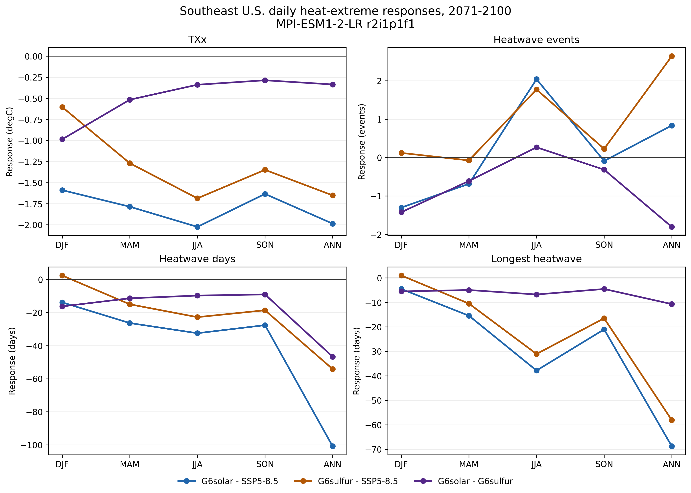
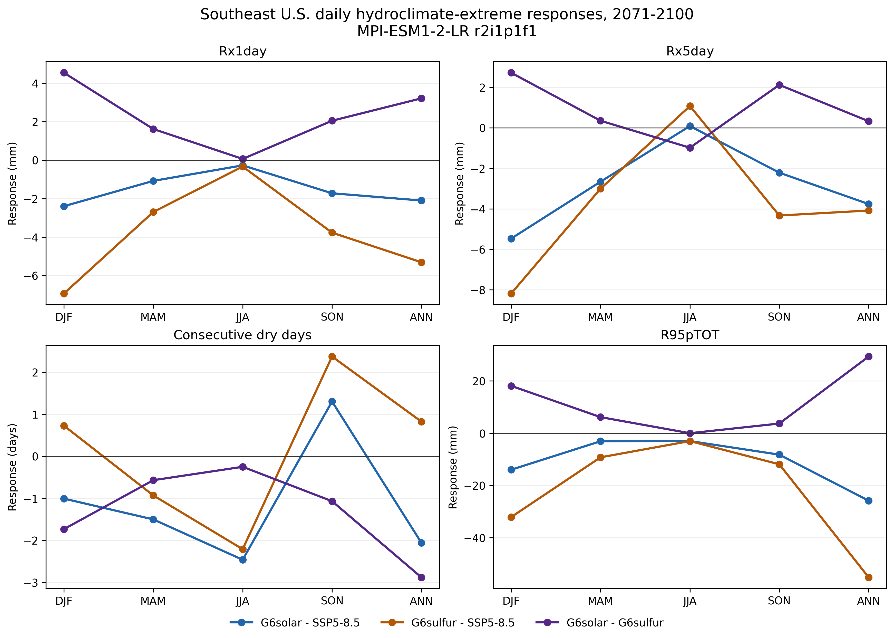

# Phase 5 checkpoint: daily heat and hydroclimate extremes

## Scientific question

Do the comparatively mixed monthly precipitation responses in Phase 4 translate into meaningful late-century changes in Southeast U.S. extreme rainfall or dry spells, and how do daily heat extremes differ between G6solar and G6sulfur?

This checkpoint evaluates modeled regional climate response. It does not evaluate intervention engineering, impacts, or desirability.

## Model selection

The federated ESGF daily archive contains only one model-member-grid combination with matched `tasmax` and `pr` for G6solar, G6sulfur, SSP5-8.5, and the historical threshold period through the required dates: MPI-ESM1-2-LR `r2i1p1f1` on `gn`.

CNRM-ESM2-1 lacks daily G6solar, IPSL-CM6A-LR lacks the required daily G6 experiments, UKESM1-0-LL lacks daily G6sulfur and does not provide the Phase 4 member as a complete triplet, CESM2-WACCM lacks daily G6sulfur, and MPI-ESM1-2-HR lacks the matched pair. Other MPI-ESM1-2-LR members were not substituted because some end in 2099 and changing members would break the exact Phase 4 linkage.

The [Phase 5 model-selection log](PHASE5_MODEL_SELECTION.md) records the eligibility rules, model audit, exclusions, exact source selection, and validation result.

## Provenance and validation

Two versioned manifests preserve source URL, archive version, tracking ID, byte count, SHA-256 checksum, institution, source ID, experiment ID, variant label, grid label, license, and parent metadata for 24 files. Raw NetCDF files remain outside Git.

All 24 files passed byte-count and checksum verification. The build then checked embedded source, experiment, variant, grid, tracking, parent, units, and calendar metadata. The historical branch correctly identifies piControl `r1i1p1f1`; SSP5-8.5 identifies historical `r2i1p1f1`; both G6 experiments identify SSP5-8.5 `r2i1p1f1`. Every analysis period contains one ordered value for every proleptic-Gregorian day, and the cropped regional arrays contain no missing values.

The full automated suite passes 31 tests, including unit conversion, leap-day coverage, missing-day rejection, missing-value rejection, cross-year DJF grouping, threshold construction, all eight index definitions, latitude weighting, published-result completeness, model counts, parent compatibility, grid compatibility, and prevention of variant mixing.

## Analysis method

- Domain: native-grid cell centers from 24-38°N and 100-74°W, unchanged from Phases 1-4.
- Future period: 2071-2100. MAM, JJA, SON, and annual metrics use 30 complete periods. DJF uses 29 complete winters, DJF 2072 through DJF 2100.
- Historical thresholds: 1981-2010 from MPI-ESM1-2-LR historical `r2i1p1f1`.
- TX90: calendar-day 90th percentile with a centered five-day window.
- Heatwave: at least three consecutive days with `tasmax` above TX90. HWN is event count, HWF is participating days, and HWD is the longest event.
- TXx: maximum daily `tasmax` within each year or season.
- Rx1day: maximum one-day precipitation.
- Rx5day: maximum consecutive five-day precipitation total, with windows restricted to the evaluated year or season.
- CDD: longest run with precipitation below 1 mm/day.
- R95pTOT: precipitation total on days above the historical wet-day 95th percentile, where historical wet days have at least 1 mm/day.
- Climatology: each index is calculated for each complete year or season at every native grid cell, then averaged across periods.
- Region: grid-cell climatologies are combined using cosine-of-latitude weights. Temperature and precipitation grid values are never averaged before spells or maxima are calculated.

Spells are truncated at annual and seasonal boundaries. Future years lie outside the threshold reference period, so an in-base bootstrap adjustment is not needed.

## Results

All values below are area-weighted regional differences. Negative TXx, HWF, and HWD values indicate fewer or weaker heat extremes. Precipitation indices are in mm per evaluated period, CDD and heat durations are in days, and HWN is in events.

### Annual response relative to SSP5-8.5

| Index | G6solar - SSP5-8.5 | G6sulfur - SSP5-8.5 | G6solar - G6sulfur |
|---|---:|---:|---:|
| TXx (°C) | -1.986 | -1.651 | -0.335 |
| Heatwave events | +0.834 | +2.640 | -1.805 |
| Heatwave days | -100.828 | -54.139 | -46.689 |
| Longest heatwave (days) | -68.727 | -58.043 | -10.684 |
| Rx1day (mm) | -2.100 | -5.309 | +3.209 |
| Rx5day (mm) | -3.766 | -4.086 | +0.320 |
| Consecutive dry days | -2.061 | +0.823 | -2.883 |
| R95pTOT (mm) | -25.821 | -55.169 | +29.347 |

Both interventions reduce annual TXx, heatwave days, and the longest heatwave relative to SSP5-8.5 in this run. Heatwave event counts increase while total heatwave days decline, indicating more fragmented qualifying events rather than a contradiction in the duration metrics. G6solar has a lower TXx and fewer heatwave days than G6sulfur.

Both interventions reduce annual Rx1day, Rx5day, and R95pTOT relative to SSP5-8.5, but G6sulfur has the larger reduction. Annual CDD decreases under G6solar and increases under G6sulfur.

### G6solar minus G6sulfur by season

| Index | DJF | MAM | JJA | SON | ANN |
|---|---:|---:|---:|---:|---:|
| TXx (°C) | -0.986 | -0.516 | -0.338 | -0.286 | -0.335 |
| Heatwave events | -1.423 | -0.610 | +0.267 | -0.315 | -1.805 |
| Heatwave days | -16.264 | -11.354 | -9.716 | -9.018 | -46.689 |
| Longest heatwave (days) | -5.516 | -4.951 | -6.765 | -4.525 | -10.684 |
| Rx1day (mm) | +4.540 | +1.616 | +0.061 | +2.045 | +3.209 |
| Rx5day (mm) | +2.713 | +0.345 | -0.987 | +2.113 | +0.320 |
| Consecutive dry days | -1.736 | -0.571 | -0.252 | -1.070 | -2.883 |
| R95pTOT (mm) | +18.122 | +6.156 | +0.004 | +3.699 | +29.347 |

G6solar has lower TXx, fewer heatwave days, and a shorter longest heatwave than G6sulfur in every season. Hydroclimate ordering is less uniform. G6solar has higher Rx1day and R95pTOT in every season, but Rx5day reverses in JJA. G6solar also has shorter dry spells in every season. Near-zero JJA differences in Rx1day and R95pTOT should not be treated as meaningful separation without variability analysis.

The complete machine-readable result is [phase5_daily_extremes.csv](phase5_daily_extremes.csv).

## Uncertainty and agreement

This checkpoint has one model and one member. It therefore has no inter-model spread, sign-agreement statistic, or internal-variability estimate. Agreement across seasons within one simulation is not a substitute for model agreement.

The heat metrics show internally consistent seasonal ordering between the interventions, but the magnitude depends strongly on the metric. The precipitation metrics show that annual aggregation can conceal seasonal differences, particularly the JJA reversal in Rx5day. These are scientifically useful single-model patterns, not robust GeoMIP ensemble conclusions.

## Comparison with Phase 4

Phase 4 found a mixed four-model mean-precipitation response, including a 2-2 split for the JJA G6sulfur sign and a 3-1 split for the JJA G6solar-minus-G6sulfur ordering. Phase 5 cannot test whether those model disagreements persist for daily extremes because only MPI-ESM1-2-LR supplies the complete matched daily set.

Within MPI-ESM1-2-LR, the daily results add information that monthly mean precipitation cannot provide. JJA Rx1day and R95pTOT are nearly identical between interventions, while JJA Rx5day is about 0.99 mm lower under G6solar than G6sulfur. Annually, G6solar has higher Rx1day, Rx5day, and R95pTOT but shorter dry spells. No single wetness ranking summarizes all extreme metrics.

## Limitations

- One model and one ensemble member cannot quantify structural uncertainty or internal variability.
- The rectangular domain includes ocean and locations outside some definitions of the Southeast United States.
- Cosine-latitude weighting approximates explicit cell-area weighting on this regular latitude-longitude grid.
- No observational evaluation, bias correction, significance test, or return-period analysis is included.
- A fixed 1981-2010 model threshold measures change relative to the model's historical climate, not human heat stress or local impacts.
- Seasonal boundary truncation affects spells and five-day precipitation windows that cross a boundary.
- The results describe the idealized G6 experiments, not the engineering behavior of a specific intervention system.

## Interpretation in the GeoMIP literature

The contrast between a stable heat ordering and metric-dependent precipitation ordering is consistent with the broader GeoMIP expectation that regional hydrological responses are less uniform than temperature responses. Existing G6 literature also emphasizes model dependence and differences between idealized solar dimming and sulfate aerosol forcing. Because this checkpoint has one model, it should be used to motivate a reproducible daily-extremes workflow and targeted follow-up, not to claim that one intervention has generally preferable regional extremes.

References:

- Visioni, D. et al. (2021), [Identifying the sources of uncertainty in climate model simulations of solar radiation modification with the G6sulfur and G6solar GeoMIP simulations](https://doi.org/10.5194/acp-21-10039-2021), *Atmospheric Chemistry and Physics*, 21, 10039-10063.
- Kravitz, B. et al. (2015), [The Geoengineering Model Intercomparison Project Phase 6: simulation design and preliminary results](https://doi.org/10.5194/gmd-8-3379-2015), *Geoscientific Model Development*, 8, 3379-3392.
- Climdex, [Indices](https://www.climdex.org/learn/indices/), definitions for TXx, Rx1day, Rx5day, CDD, and percentile-based extremes.
