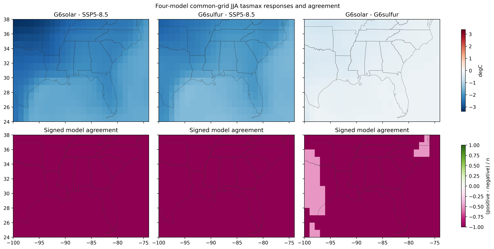
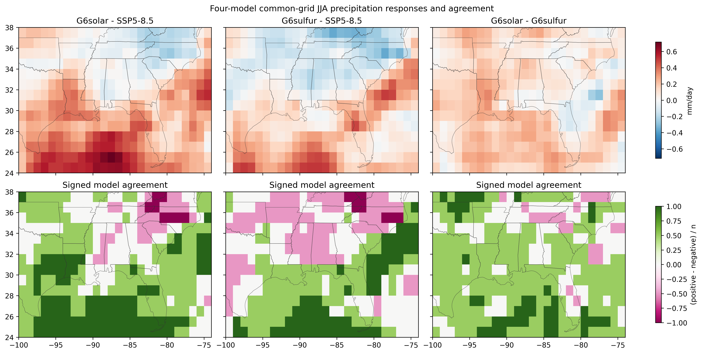
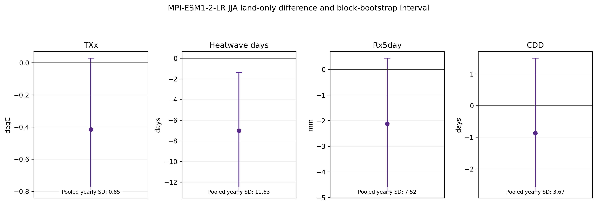

# Phase 6 checkpoint: spatial robustness, land sensitivity, and uncertainty

## Scientific question

Where do the late-century G6solar and G6sulfur temperature and precipitation responses persist across the Southeast United States, which conclusions depend on geography or individual models, and how large are selected daily-extreme differences relative to year-to-year variability?

## Data and method

The monthly analysis retains CNRM-ESM2-1, IPSL-CM6A-LR, MPI-ESM1-2-LR, and UKESM1-0-LL with the exact matched experiment members documented in the Phase 3 and 4 selection logs. The period is 2071-2100. Monthly `tasmax` and precipitation differences are formed within each model on its native grid. Native-grid fractional WGS84 area weights define the original box, Southeast land, Gulf Coast, Lower Mississippi Valley, Atlantic Southeast, and Appalachian/interior summaries.

Spatial ensemble figures use a separate 1° common grid. Temperature differences are bilinearly interpolated and precipitation differences are first-order conservatively remapped. Models are equally weighted. Agreement counts are descriptive, not probabilities or significance tests.

The daily component remains MPI-ESM1-2-LR `r2i1p1f1`, one model and one member. It preserves each complete annual or seasonal index before climatological averaging. DJF uses 29 winters; other seasons and annual results use 30 years. Historical thresholds and spell-boundary conventions remain those documented in Phase 5.

| Domain | Represented area (km²) | Contributing native cells across models |
|---|---:|---:|
| Original box | 3,844,696 mean | 132-209 |
| Southeast land | 1,862,395 mean | 77-133 |
| Gulf Coast | 917,554 mean | 46-73 |
| Lower Mississippi Valley | 489,638 mean | 25-46 |
| Atlantic Southeast | 583,810 mean | 36-53 |
| Appalachian/interior | 281,430 mean | 17-33 |

Cell counts vary with native resolution. Represented area is stable across grids; small differences arise from geodesic segmentation and boundary intersection. Equivalent-cell totals and per-model values are included in `phase6_domain_per_model.csv`.

## Monthly regional findings

All values are G6solar minus G6sulfur ensemble means. Ranges are individual model minimum to maximum.

| Domain | Metric and season | Mean | Model range | Positive-negative count |
|---|---|---:|---:|---:|
| Original box | JJA tasmax (°C) | -0.308 | -0.402 to -0.188 | 0-4 |
| Southeast land | JJA tasmax (°C) | -0.374 | -0.447 to -0.239 | 0-4 |
| Gulf Coast | JJA tasmax (°C) | -0.373 | -0.483 to -0.200 | 0-4 |
| Original box | MAM tasmax (°C) | -0.249 | -0.763 to +0.112 | 2-2 |
| Southeast land | MAM tasmax (°C) | -0.228 | -0.878 to +0.210 | 2-2 |
| Original box | JJA precipitation (mm/day) | +0.127 | -0.104 to +0.256 | 3-1 |
| Southeast land | JJA precipitation (mm/day) | +0.109 | -0.140 to +0.355 | 3-1 |
| Gulf Coast | JJA precipitation (mm/day) | +0.129 | -0.185 to +0.377 | 2-2 |
| Southeast land | Annual precipitation (mm/day) | +0.017 | -0.031 to +0.062 | 2-2 |
| Southeast land | MAM precipitation (mm/day) | -0.089 | -0.226 to +0.102 | 1-3 |

The summer temperature ordering persists and strengthens modestly over land: all four models have lower JJA `tasmax` under G6solar than G6sulfur. No leave-one-model-out calculation reverses this sign. MAM temperature remains unresolved, with a 2-2 split. Over the Gulf Coast its ensemble sign reverses when MPI-ESM1-2-LR is omitted.

Precipitation conclusions depend more strongly on region and model. The original-box annual direct difference is positive in all four models, but the Southeast-land annual sign splits 2-2. JJA is 3-1 over the original box and land-only Southeast, then 2-2 over Gulf Coast states. Across direct precipitation comparisons, 15 leave-one-model-out cases reverse the full-ensemble sign in 14 domain-season combinations.

On the 364-cell common grid, all JJA temperature ensemble-mean differences are negative. For model signs, 326 cells have four negative models and 38 have three negative and one positive. JJA precipitation has 212 cells with a 3-1 positive split, 87 with 2-2, 43 with 4-0, and 22 with 1-3. These counts describe structural agreement in this four-model sample.

## Daily land-only variability

The Southeast land mask represents about 1.862 million km² on the MPI native grid and intersects 77 cells. Values below are G6solar minus G6sulfur. Intervals are 95% moving-block bootstrap intervals for within-simulation temporal sampling variability.

| Period | Metric | Difference | Interval | Pooled annual SD |
|---|---|---:|---:|---:|
| JJA | TXx (°C) | -0.416 | -0.800 to +0.028 | 0.848 |
| JJA | Heatwave days | -7.019 | -12.887 to -1.384 | 11.628 |
| JJA | Rx5day (mm) | -2.126 | -4.760 to +0.435 | 7.525 |
| JJA | CDD (days) | -0.874 | -2.709 to +1.497 | 3.674 |
| Annual | TXx (°C) | -0.400 | -0.768 to +0.015 | 0.831 |
| Annual | Heatwave days | -35.970 | -52.848 to -18.461 | 25.283 |
| Annual | Rx5day (mm) | +1.330 | -2.308 to +4.722 | 8.445 |
| Annual | CDD (days) | -3.573 | -6.977 to +0.185 | 6.323 |

Only heatwave-day intervals exclude zero. TXx retains a negative point estimate but is not clearly separated from this simulation's year-to-year variability under the documented bootstrap. Rx5day reverses between JJA and annual averaging, and both intervals include zero. These are single-model, single-member results and are not evidence of structural model agreement.

## Comparison with Phases 3 to 5

The Phase 3 JJA temperature conclusion persists over Southeast land and all broad subregions. Its MAM disagreement also persists. Phase 4's mixed seasonal precipitation response weakens further under land-only and subregional definitions, especially for annual and Gulf Coast JJA results. Phase 5's daily climatological differences are retained as historical reference outputs; Phase 6 adds land-only weighting and year-level context, which makes clear that several apparent daily differences are small relative to temporal variability.

## Limitations

- Four monthly models remain a small and structurally dependent ensemble.
- Equal weighting does not account for genealogy, skill, or dependence.
- Boundary intersections improve area representation but cannot create sub-grid climate detail.
- Common-grid maps depend on the stated regridding methods and are not used for authoritative regional summaries.
- The daily analysis has one model and member. Bootstrap intervals measure sampling variation within that simulation, not structural uncertainty.
- No observational evaluation, bias correction, formal significance testing, or multiple-member internal-variability ensemble is included.

The defensible conclusion is narrow: the JJA temperature ordering is spatially and geographically consistent in this four-model sample, while MAM temperature and most precipitation orderings remain model- or geography-dependent.
