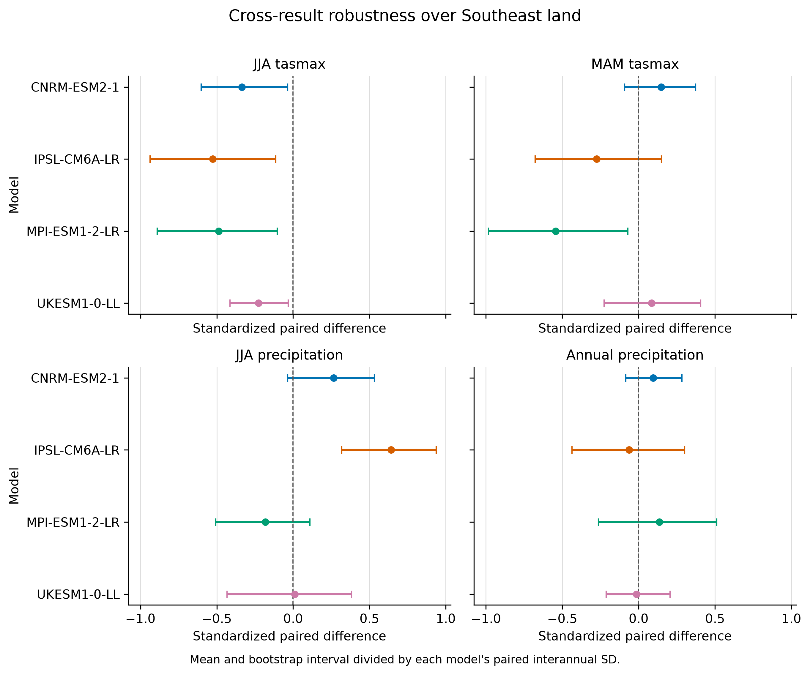

# Phase 7 checkpoint: temporal variability and effect size

## Scientific question

Are the late-century G6solar-minus-G6sulfur regional differences found in Phase 6 large relative to year-to-year variability within each model simulation, and which results are strongest enough for manuscript interpretation?

## Why Phase 7 was needed

Phase 6 established spatial and geographic robustness, structural model agreement, and leave-one-model-out sensitivity. Its four-model monthly climatologies did not show how consistently each model produced the same ordering from year to year. Phase 7 retains the Phase 6 means exactly while adding paired seasonal-year variability, standardized effects, and temporal-sampling intervals. It does not combine these temporal intervals with spread across models.

## Data and domains

The monthly models are CNRM-ESM2-1, IPSL-CM6A-LR, MPI-ESM1-2-LR, and UKESM1-0-LL. Each model retains its manifest-recorded experiment member, grid, and parent-run metadata for G6solar, G6sulfur, and SSP5-8.5. Variables are monthly `tasmax` and precipitation only.

The analysis uses the unchanged Phase 6 fractional WGS84 geodesic area weighting on each model's native grid. The three retained domains are:

- original 24-38°N, 100-74°W box
- Southeast land-only
- Gulf Coast states

The boundary and land-mask sources, represented areas, fractional-cell method, and resolution limitations remain documented in `PHASE6_GEOGRAPHY.md`. No new geographic definition was introduced.

## Paired time-series method

Monthly values are day weighted within each complete seasonal year and then spatially averaged using the Phase 6 native-grid weights. ANN, MAM, JJA, and SON contain 30 values for 2071-2100. December is assigned to the following DJF year, giving 29 complete winters for DJF 2072-2100.

For each model, domain, metric, season, and comparison, the build requires identical period-year labels in both experiments and calculates the target-minus-reference difference for each year before any statistic. A missing, duplicate, or misaligned year stops the build. The main comparison is G6solar minus G6sulfur. Both intervention-minus-SSP5-8.5 comparisons remain in the machine-readable outputs as context.

## Temporal-variability method

For paired differences \(D_t\), the reported quantities are the mean, median, sample standard deviation, conventional standard error \(s_D/\sqrt{n}\), range, year count, sign fractions, and lag-1 autocorrelation. The standardized paired effect is

\[
d_z = \frac{\bar{D}}{s_D},
\]

where \(s_D\) is the sample standard deviation of the paired annual or seasonal differences. This expresses the climatological contrast in units of that model's paired interannual variability. It is not a cross-model effect size.

## Moving-block bootstrap

The 95% interval is the 2.5th to 97.5th percentile of 10,000 circular moving-block bootstrap means. Each replicate samples random five-year blocks with replacement, joins enough blocks to reach the original series length, and truncates to 29 or 30 values. Five-year blocks preserve short multi-year persistence while retaining about six blocks in a 30-year record. A SHA-256 hash of the complete analysis identity supplies a reproducible random seed.

These intervals quantify temporal sampling uncertainty within one model simulation under the stated resampling assumptions. They are not structural uncertainty across GeoMIP models. The conventional standard error is reported descriptively; the block interval is used for temporal-dependence-aware interpretation.

A targeted block-length check repeats the primary JJA `tasmax` intervals with three-, five-, and seven-year blocks. CNRM-ESM2-1, IPSL-CM6A-LR, and MPI-ESM1-2-LR remain below zero over the original box and Southeast land under all three choices. UKESM1-0-LL includes zero with three-year blocks but falls below zero with five- and seven-year blocks in those domains. Over the Gulf Coast, the five- and seven-year classifications are unchanged at two intervals below zero and two including zero; the three-year choice moves IPSL-CM6A-LR just below zero. Thus the all-four interval result over the original box and land is somewhat dependent on block length, while the negative four-model mean ordering is not.

## Main JJA `tasmax` result

All values below are G6solar minus G6sulfur. Negative values mean lower JJA `tasmax` under G6solar.

| Domain | Model | Mean (°C) | Paired SD (°C) | Effect size | 95% block interval (°C) | Negative years |
|---|---|---:|---:|---:|---:|---:|
| Original box | CNRM-ESM2-1 | -0.294 | 0.668 | -0.440 | -0.469 to -0.098 | 60% |
| Original box | IPSL-CM6A-LR | -0.349 | 0.571 | -0.611 | -0.599 to -0.088 | 73% |
| Original box | MPI-ESM1-2-LR | -0.402 | 0.593 | -0.678 | -0.661 to -0.168 | 73% |
| Original box | UKESM1-0-LL | -0.188 | 0.673 | -0.279 | -0.315 to -0.048 | 60% |
| Southeast land | CNRM-ESM2-1 | -0.378 | 1.130 | -0.335 | -0.680 to -0.041 | 53% |
| Southeast land | IPSL-CM6A-LR | -0.434 | 0.824 | -0.526 | -0.773 to -0.094 | 73% |
| Southeast land | MPI-ESM1-2-LR | -0.447 | 0.916 | -0.488 | -0.815 to -0.095 | 67% |
| Southeast land | UKESM1-0-LL | -0.239 | 1.057 | -0.226 | -0.438 to -0.034 | 60% |
| Gulf Coast | CNRM-ESM2-1 | -0.433 | 1.135 | -0.382 | -0.720 to -0.144 | 60% |
| Gulf Coast | IPSL-CM6A-LR | -0.374 | 0.871 | -0.429 | -0.746 to +0.002 | 57% |
| Gulf Coast | MPI-ESM1-2-LR | -0.483 | 0.966 | -0.500 | -0.867 to -0.126 | 73% |
| Gulf Coast | UKESM1-0-LL | -0.200 | 1.097 | -0.182 | -0.531 to +0.154 | 60% |

All four model means remain negative in all three domains. Under the primary five-year blocks, all four temporal intervals exclude zero over the original box and Southeast land, while two of four exclude zero over the Gulf Coast. The ensemble mean is more negative over Southeast land (-0.374°C) than over the original box (-0.308°C), and every model's land-only mean is more negative than its original-box mean. UKESM1-0-LL has the weakest standardized effect in all three domains, and its original-box and land-only classifications change when three-year blocks are used. The result is therefore strongest for the negative model-mean ordering; the exact interval count is less stable.

## Reassessment of unresolved Phase 6 results

The table summarizes the direct comparison. Interval counts refer to the number of model-level temporal intervals below zero, above zero, or including zero.

| Domain and result | Model mean signs | Ensemble mean | Inter-model SD | Below / above / includes zero |
|---|---:|---:|---:|---:|
| Southeast land, MAM tasmax | 2 negative, 2 positive | -0.228°C | 0.504°C | 1 / 0 / 3 |
| Southeast land, JJA precipitation | 1 negative, 3 positive | +0.109 mm/day | 0.218 mm/day | 0 / 1 / 3 |
| Southeast land, annual precipitation | 2 negative, 2 positive | +0.017 mm/day | 0.043 mm/day | 0 / 0 / 4 |
| Gulf Coast, JJA precipitation | 2 negative, 2 positive | +0.129 mm/day | 0.282 mm/day | 0 / 2 / 2 |
| Original box, JJA precipitation | 1 negative, 3 positive | +0.127 mm/day | 0.162 mm/day | 0 / 2 / 2 |
| Original box, annual precipitation | 0 negative, 4 positive | +0.049 mm/day | 0.035 mm/day | 0 / 0 / 4 |

MAM `tasmax` remains unresolved. Only MPI-ESM1-2-LR has a negative interval excluding zero over Southeast land; the other three intervals include zero, and model mean signs split 2-2.

Temporal variability further weakens the broad precipitation interpretation. The Southeast-land annual result has a 2-2 mean-sign split and all intervals include zero. For JJA precipitation, IPSL-CM6A-LR is the only Southeast-land model with a positive interval excluding zero. Over the Gulf Coast, CNRM-ESM2-1 and IPSL-CM6A-LR have positive intervals excluding zero, while MPI-ESM1-2-LR and UKESM1-0-LL have negative means whose intervals include zero. Even the original-box annual precipitation ordering, positive in all four model means, has four intervals that include zero.

## Ensemble synthesis

The ensemble table reports model count, positive and negative model means, temporal-interval classifications, equally weighted mean and median model differences, and sample SD across the four climatological model means. It deliberately has no ensemble confidence interval. Temporal uncertainty remains in the per-model rows; structural spread remains the variation among model means.

For the main JJA `tasmax` comparison, the inter-model SD is 0.091°C for the original box, 0.095°C for Southeast land, and 0.123°C for the Gulf Coast. These structural spreads are smaller than each model's paired interannual SD, but the consistently negative 30-year means and block intervals over the original box and Southeast land support the ordering in this four-model sample.

## Comparison with Phase 6

Phase 7 reproduces all 120 Phase 6 G6solar-minus-G6sulfur model-domain-metric-season means for the three retained domains exactly at the committed output precision. It adds temporal interpretation without revising the Phase 6 weighting, geography, or climatologies.

The Phase 6 JJA temperature ordering survives: all model means remain negative and land-only differences remain modestly larger in magnitude. With the primary five-year blocks, all original-box and land-only intervals exclude zero, although the UKESM1-0-LL classifications include zero with three-year blocks. The Phase 6 MAM temperature disagreement persists. The Phase 6 precipitation findings weaken because most model-level intervals include zero even where a majority or all four climatological means share a sign.

## Limitations

- Each experiment contributes one ensemble member per model. Year-to-year variability in a single simulation is not a full estimate of internal climate variability.
- Nominal years are paired as required, but weather sequences in separate scenario integrations are not necessarily synchronized. The paired SD can therefore reflect unsynchronized internal variability as well as any shared variability and changing forced response.
- The 29- or 30-year series is short for estimating low-frequency persistence. Five-year blocks are a documented compromise, not a uniquely determined choice.
- The analysis does not detrend the paired series. Reported temporal variability can include evolution of the forced difference during 2071-2100.
- Bootstrap intervals depend on stationarity and block-resampling assumptions and should not be interpreted as structural-model uncertainty or observationally calibrated confidence.
- Four models remain a small, structurally dependent sample. Equal weighting does not account for model genealogy or performance.
- No observational evaluation, bias correction, formal multiple-testing correction, or initial-condition ensemble is included.

## Manuscript-oriented interpretation

The strongest result is narrow: G6solar produces lower late-century JJA `tasmax` than G6sulfur in all four matched models across the original box, Southeast land, and Gulf Coast. Under the primary five-year blocks, temporal intervals exclude zero in all four models over the original box and Southeast land, but only two over the Gulf Coast. A three-year sensitivity case reduces the first two counts to three of four. The standardized effects are modest, ranging from -0.226 to -0.526 over Southeast land, so model consistency across the 30-year means is more compelling than any single interval threshold.

MAM temperature and precipitation should be presented as disagreement results. Their sign sensitivity, model-specific intervals, and geography dependence do not support a single robust regional ordering.

## Remaining manuscript-readiness gaps

1. A clear manuscript decision is needed on the inferential meaning of pairing nominal years when scenario weather is not dynamically synchronized.
2. Initial-condition ensembles, where available, would materially improve separation of forced response from internal variability. Their absence should be explicit if the manuscript proceeds with one member per model.
3. The literature comparison and methods text need formal citations and journal-specific formatting before submission.

These are manuscript tasks or targeted checks, not a basis for adding new variables, regions, models, or application features to Phase 7.
